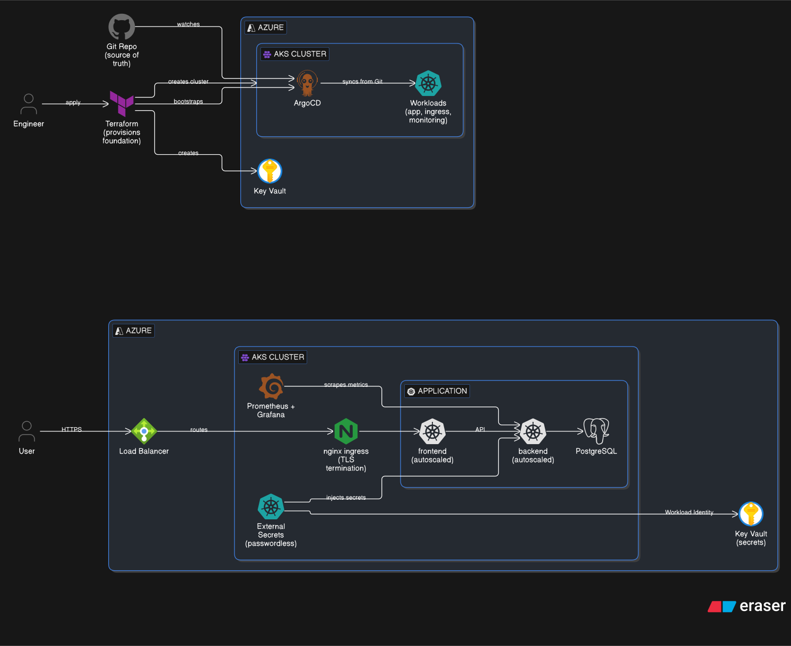

# Jerney — AKS

Production-style Azure Kubernetes Service deployment of the Jerney application, built as a 1:1 mirror of [jerney-gke](https://github.com/NilkanthMiyani/jerney-gke) for hands-on Azure learning.



---

## Stack

| Layer | Technology |
|---|---|
| Cloud | Azure (AKS, Key Vault, Managed Identity) |
| IaC | Terraform (azurerm ~> 4.0) using Workspaces |
| GitOps | ArgoCD (App-of-Apps pattern) |
| Ingress | NGINX Ingress Controller + cert-manager (Let's Encrypt) |
| Observability | Prometheus + Grafana + Loki + Alertmanager |
| Secrets | Azure Key Vault + External Secrets Operator (Workload Identity) |
| App | Jerney (React frontend + Node backend + PostgreSQL) |

---

## Repository Structure

```
jerney-aks/
├── infra/                      # Flat Terraform infrastructure code
│   ├── aks-cluster.tf          # AKS cluster + system node pool
│   ├── bootstrap.tf            # ArgoCD + ESO Helm + ClusterSecretStore + root app
│   ├── iam.tf                  # Managed identities + role assignments + federated credentials
│   ├── networking.tf           # VNet + AKS node subnet + NSGs
│   ├── secrets.tf              # Key Vault + secrets + ESO role assignment
│   ├── versions.tf             # Terraform backend configuration
│   ├── providers.tf            # azurerm with features block + helm config
│   ├── variables.tf            # All input variables
│   ├── outputs.tf              # All outputs
│   ├── dev.tfvars              # Dev environment configuration
│   ├── staging.tfvars          # Staging environment configuration
│   └── prod.tfvars             # Production environment configuration
└── k8s-aks/
    ├── apps/                   # ArgoCD Application CRs (App-of-Apps; root app seeded by Terraform)
    │   ├── cert-manager.yaml   # wave 0
    │   ├── ingress-nginx.yaml  # wave 0
    │   ├── platform-config.yaml# wave 0 — namespaces + resource quotas
    │   ├── platform-secrets.yaml# wave 1 — ExternalSecrets (store created by Terraform)
    │   ├── prometheus-stack.yaml# wave 1
    │   ├── jerney.yaml         # wave 1
    │   ├── loki-stack.yaml     # wave 2
    │   └── ingress-apps.yaml   # wave 2 — ClusterIssuer + Ingress resources
    ├── helm/jerney/            # Jerney application Helm chart
    │   ├── Chart.yaml
    │   ├── values.yaml
    │   └── templates/
    │       ├── backend-deployment.yaml
    │       ├── frontend-deployment.yaml
    │       ├── backend-service.yaml
    │       ├── frontend-service.yaml
    │       ├── ingress.yaml
    │       ├── hpa.yaml
    │       └── network-policies.yaml
    └── platform/
        ├── governance/         # ResourceQuotas + LimitRanges per namespace
        ├── ingress/            # ClusterIssuer + Ingress resources
        ├── external-secrets/   # ExternalSecret CRs (3 secrets)
        ├── prometheus-stack/   # Helm values
        └── loki-stack/         # Helm values
```

> The Terraform code uses a **flat structure** with **Terraform Workspaces**. 
> Instead of deeply nested modules, all resources live in the `infra/` directory. Each environment (dev, staging, prod) has its own `<env>.tfvars` file and its own dedicated Terraform Workspace to isolate state (`env:/<workspace_name>/`).

---

## AKS Architecture & Patterns

*The following patterns govern this repository's infrastructure, strictly adhering to Azure/AKS best practices.*

### Providers
```hcl
required_providers {
  azurerm    = { source = "hashicorp/azurerm",    version = "~> 4.0"  }
  helm       = { source = "hashicorp/helm",       version = "~> 2.16" }
  tls        = { source = "hashicorp/tls",        version = "~> 4.0"  }
}
```
**AzureRM requires a `features {}` block** in the provider config (even if empty).

### Backend
Azure Storage Account with blob container. Locking is built-in via blob leases. 
```hcl
backend "azurerm" {
  resource_group_name  = "<rg>"
  storage_account_name = "<account>"
  container_name       = "tfstate"
  key                  = "<project>/terraform.tfstate"
}
```

### Networking (networking.tf)
- Resource Group (all resources belong to one).
- VNet with custom subnets.
- Separate subnets for: AKS nodes, AKS pods (if using Azure CNI Overlay), application gateways.
- NSGs (Network Security Groups) for subnet-level firewall rules.
- No NAT Gateway needed for basic egress (AKS uses load balancer outbound rules by default). Add NAT Gateway for stable egress IPs.

### IAM (iam.tf)
AKS uses Azure AD + Managed Identities:
- **System-assigned identity** on the AKS cluster (simplest).
- **User-assigned identity** for more control (recommended for prod).
- Role assignments: `Network Contributor` on VNet (if using custom VNet), `AcrPull` on ACR.
- No equivalent of AWS IAM roles for service accounts in the traditional sense — AKS uses **Workload Identity** (Azure AD federated credentials).

### AKS Cluster (aks-cluster.tf)
- `azurerm_kubernetes_cluster` with `default_node_pool`.
- Azure CNI or kubenet for networking.
- Workload Identity enabled: `oidc_issuer_enabled = true`, `workload_identity_enabled = true`.
- Azure Key Vault Secrets Provider as an addon (alternative to ESO).
- AKS manages CoreDNS and kube-proxy automatically — no addon resources needed.

### Workload Identity (irsa.tf equivalent)
AKS Workload Identity pattern:
1. Create Azure AD Application / User-Assigned Managed Identity.
2. Create federated credential linking K8s SA → Azure identity.
3. Annotate K8s SA with `azure.workload.identity/client-id`.
```
azurerm_user_assigned_identity → azurerm_federated_identity_credential → K8s SA annotation
```

| Service | Identity | Key Roles |
|---------|----------|-----------|
| ESO | <project>-eso | Key Vault Secrets User |
| Cert Manager (if used) | <project>-cert-manager | DNS Zone Contributor |

### Node Scaling
AKS supports both:
- **Cluster Autoscaler**: built-in, enabled via `auto_scaling_enabled = true` on the node pool. No Helm install needed.
- **Karpenter (NAP)**: AKS adopted Karpenter via Node Auto Provisioning (GA 2026). Same NodePool CRD as EKS.
- KEDA is also available as a native AKS addon for event-driven pod autoscaling (scale to zero).

### Ingress
AKS options:
- **NGINX Ingress Controller**: Helm install, most portable across clouds.
- **Application Gateway Ingress Controller (AGIC)**: Azure-native L7 load balancer.
- **Azure ALB Controller (preview)**: similar to AWS ALB Controller.
cert-manager + Let's Encrypt is the standard for TLS on AKS (no ACM equivalent).

### Secrets
Azure Key Vault. Two approaches:
- **ESO with Key Vault**: ClusterSecretStore uses `provider: azurekv`. Consistent with EKS/GKE pattern. (Used here).
- **AKS Key Vault Secrets Provider addon**: CSI driver that mounts Key Vault secrets as volumes. Azure-native but less flexible than ESO.

### Bootstrap (bootstrap.tf)
Install order:
1. StorageClass: AKS default `managed-csi` is usually fine.
2. `helm_release.argocd` → `helm_release.argocd_apps`
3. `helm_release.external_secrets` (with Workload Identity annotation)
4. `helm_release.nginx_ingress` (if using NGINX) or AGIC via AKS addon
5. `helm_release.cert_manager` (if using Let's Encrypt)
No Cluster Autoscaler Helm install needed if using built-in auto-scaling.

### AKS Gotchas
1. **Resource Group scope**: Azure creates a second resource group (`MC_*`) for node resources. Don't manually modify it.
2. **AKS manages its own upgrades**: node image upgrades happen automatically unless disabled. Control via `maintenance_window`.
3. **Terraform destroy order**: AKS load balancer public IPs can block VNet/subnet deletion. Delete services with `type: LoadBalancer` first.
4. **cert-manager ACME HTTP-01 timeouts**: if using HTTP-01 challenges, ensure the ingress controller can route `.well-known/acme-challenge` before cert issuance.
5. **ArgoCD overwriting Terraform-managed secrets**: if both ArgoCD and Terraform manage the same secret, ArgoCD's selfHeal will fight Terraform. Pick one owner.
6. **`app.kubernetes.io/instance` label collision**: set `application.instanceLabelKey: argocd.argoproj.io/instance` in ArgoCD config.
7. **NetworkPolicy + NGINX**: if using NetworkPolicies, ensure the policy allows traffic from the NGINX ingress controller namespace to app namespaces.

---

## Setup

### Prerequisites

```bash
az --version        # Azure CLI
terraform --version # >= 1.5
kubectl
helm
```

Log in to Azure:
```bash
az login
az account set --subscription <YOUR_SUBSCRIPTION_ID>
```

---

### Step 1 — Deploy an environment

Pick the environment you want to deploy (`dev`, `staging`, or `prod`) and initialize the Terraform workspace.

```bash
cd infra/
terraform init

# Create and select the workspace
terraform workspace new dev
# or: terraform workspace select dev
```

Run apply by pointing to the specific tfvars file for that environment:

```bash
terraform apply -var-file="dev.tfvars" \
  -var="postgres_password=your-postgres-password" \
  -var="grafana_admin_password=your-grafana-password" \
  -var="alertmanager_smtp_key=your-smtp-key"
```

This creates: VNet, AKS cluster, Key Vault + secrets, managed identities, ArgoCD, ESO, ClusterSecretStore.

> ArgoCD, ESO, the ClusterSecretStore, and the root app-of-apps are all applied automatically by `terraform apply` (the `bootstrap.tf` configuration) -- no post-setup script needed.

Apply takes ~15 minutes. ArgoCD then syncs all apps automatically.

---

### Step 2 — Connect kubectl

```bash
# Resource group / cluster names follow jerney-aks-<env>(-rg). For dev:
az aks get-credentials --resource-group jerney-aks-dev-rg --name jerney-aks-dev
kubectl get nodes

# Or just run the command Terraform prints:
terraform output kubectl_config_command
```

---

### Step 3 — Point DNS

```bash
kubectl get svc -n ingress-nginx
# Wait for EXTERNAL-IP to be assigned
```

In your DNS provider, create A records pointing to the NGINX external IP:

```
argocd.nilkanthprojects.site  →  <EXTERNAL-IP>
grafana.nilkanthprojects.site →  <EXTERNAL-IP>
jerney.nilkanthprojects.site  →  <EXTERNAL-IP>
```

cert-manager issues Let's Encrypt certificates automatically once DNS resolves.

---

### Step 4 — Verify

```bash
# All apps synced
kubectl get apps -n argocd

# TLS certificates issued
kubectl get certificates -A

# Secrets synced from Key Vault
kubectl get externalsecrets -A

# All pods healthy
kubectl get pods -A
```

Access ArgoCD UI:
```bash
kubectl port-forward svc/argo-cd-argocd-server 8080:80 -n argocd
# http://localhost:8080
# Password:
kubectl get secret argocd-initial-admin-secret -n argocd \
  -o jsonpath='{.data.password}' | base64 -d
```

---

## Day-2 Operations

### Update application image

Edit `k8s-aks/helm/jerney/values.yaml`, change `image.backend.tag` or `image.frontend.tag`, push. ArgoCD picks it up automatically.

### Rotate a secret

```bash
az keyvault secret set \
  --vault-name <KEY_VAULT_NAME> \
  --name jerney-postgres-password \
  --value "new-password"

# Force ESO to refresh without waiting 1h
kubectl annotate externalsecret jerney-db-credentials \
  -n jerney force-sync=$(date +%s) --overwrite
```

Get the Key Vault name:
```bash
cd infra/ && terraform output key_vault_name
```

### Scale nodes manually

```bash
az aks nodepool scale \
  --resource-group jerney-aks-dev-rg \
  --cluster-name jerney-aks-dev \
  --name system \
  --node-count 3
```

Or edit `min_node_count` / `max_node_count` in `infra/dev.tfvars` and `terraform apply` — AKS autoscaler handles the rest.

### Destroy everything

```bash
cd infra/
terraform workspace select dev
terraform destroy -var-file="dev.tfvars"
```
